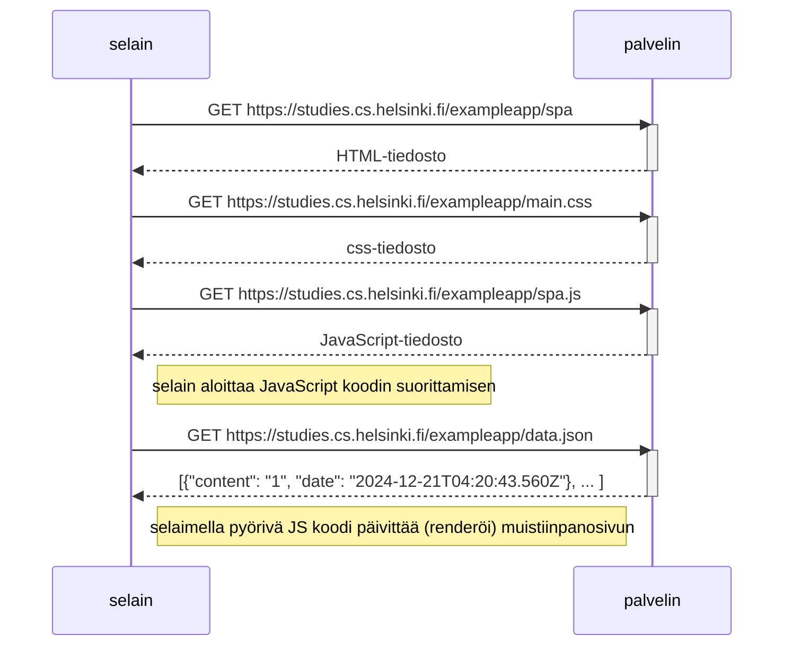

```mermaid
sequenceDiagram
    participant selain
    participant palvelin
    
    selain->>palvelin: GET https://studies.cs.helsinki.fi/exampleapp/spa
    activate palvelin
    palvelin-->>selain: HTML-tiedosto
    deactivate palvelin
    
    selain->>palvelin: GET https://studies.cs.helsinki.fi/exampleapp/main.css
    activate palvelin
    palvelin-->>selain: css-tiedosto
    deactivate palvelin

 
    selain->>palvelin: GET https://studies.cs.helsinki.fi/exampleapp/spa.js
    activate palvelin
    palvelin-->>selain: JavaScript-tiedosto
    deactivate palvelin

    Note right of selain: selain aloittaa JavaScript koodin suorittamisen
    
    selain->>palvelin: GET https://studies.cs.helsinki.fi/exampleapp/data.json
    activate palvelin
    palvelin-->>selain: [{"content": "1", "date": "2024-12-21T04:20:43.560Z"}, ... ]
    deactivate palvelin

    Note right of selain: selaimella pyörivä JS koodi päivittää (renderöi) muistiinpanosivun
```    

